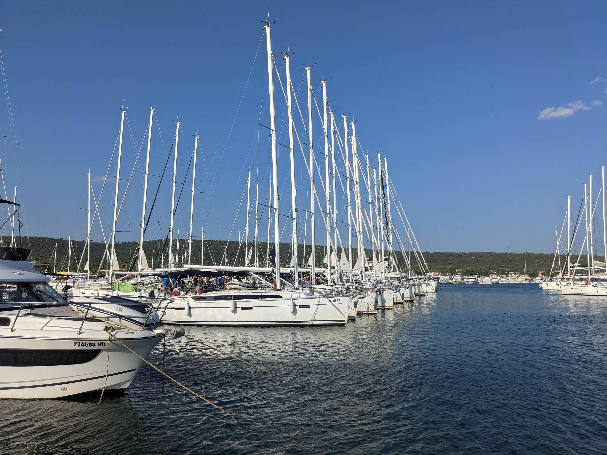

This year, 2024, became the year in which my journey into the world of sailing reached another milestone — I've chartered a boat and skippered it myself! It was an amazing experience, and to my relief, a lot less things went wrong than I had anticipated[^1]. Despite of that, I had a fair share of "lesson learned" moments and thought that it'd be worthwhile to write down a bunch of these learnings. More specifically, I'll try to distill my experience of chartering a mid-thirty foot sailboat for a week in Croatia.

On the internet, there seem to be many [resources](https://www.yachtingmonthly.com/sailing-skills/skippering-a-boat-for-the-first-time-steps-to-success-74120) and [tips](https://www.pbo.co.uk/seamanship/first-time-boat-skipper-tips-for-your-first-voyage-in-charge-87488) regarding skippering a boat for the first time, but not quite as much information about the actual process of _chartering_. Furthermore, skippers generally go through courses that teach them how to sail, dock (but usually not quite well enough for the Med 😅) or passage plan, but often don't cover how to operate the waste tank, how to make sure the boat's batteries are in good shape, or how to avoid the charter agency charging you for damages that you haven't done.

With that in mind, I'll try to start with charter tips, and then follow up with a bunch of my first-time skippering learnings as well. Note that this isn't going to be a comprehensive list at all, but mostly specific tips stemming from my personal, and obviously quite limited experience.

[^1]: If you've ever sailed before, you know that things go wrong all the time, so it's usually better to expect the worst and be prepared 🙃.
