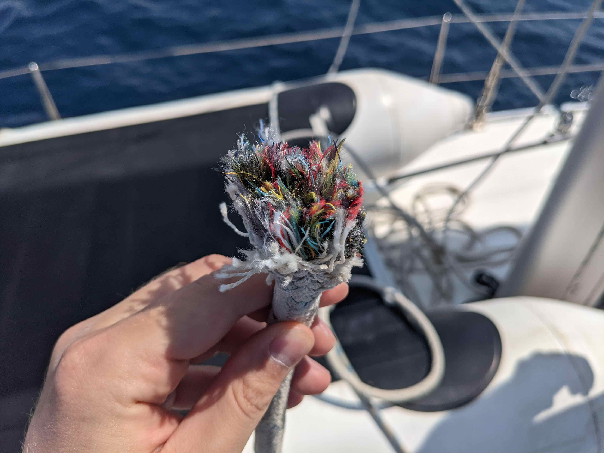
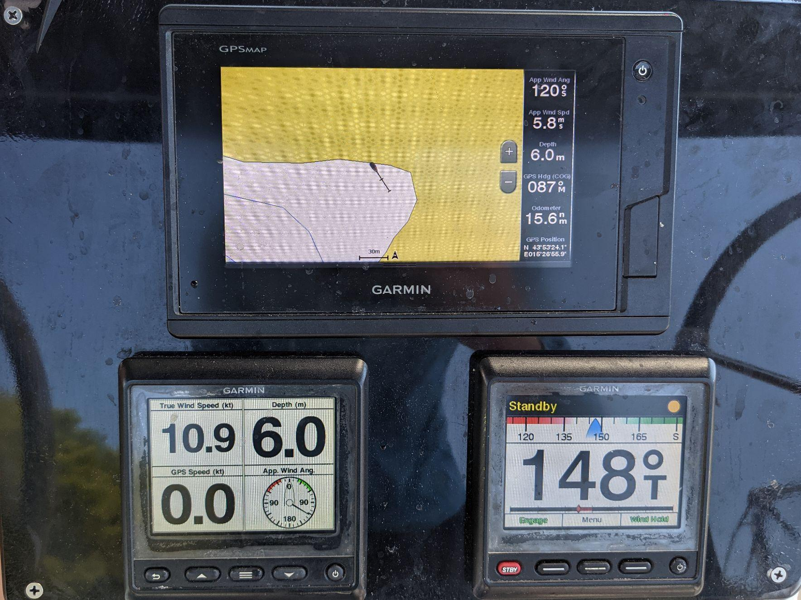
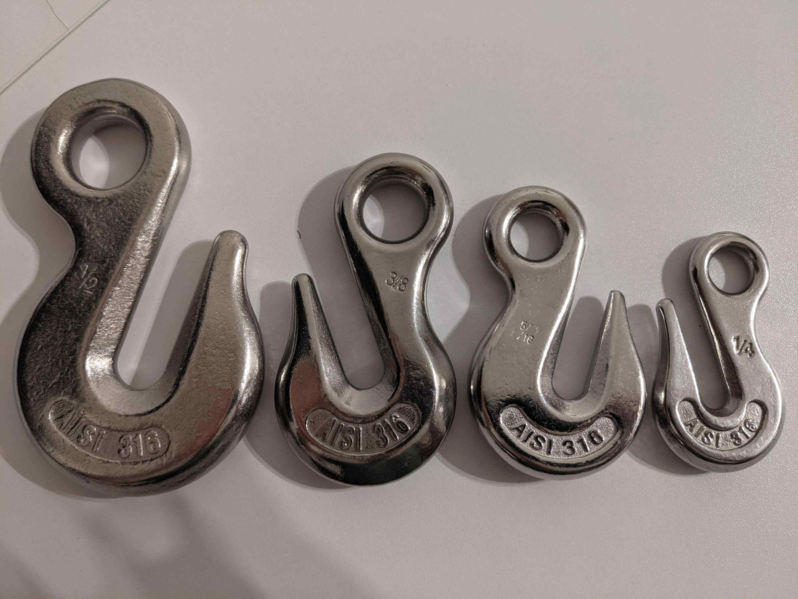
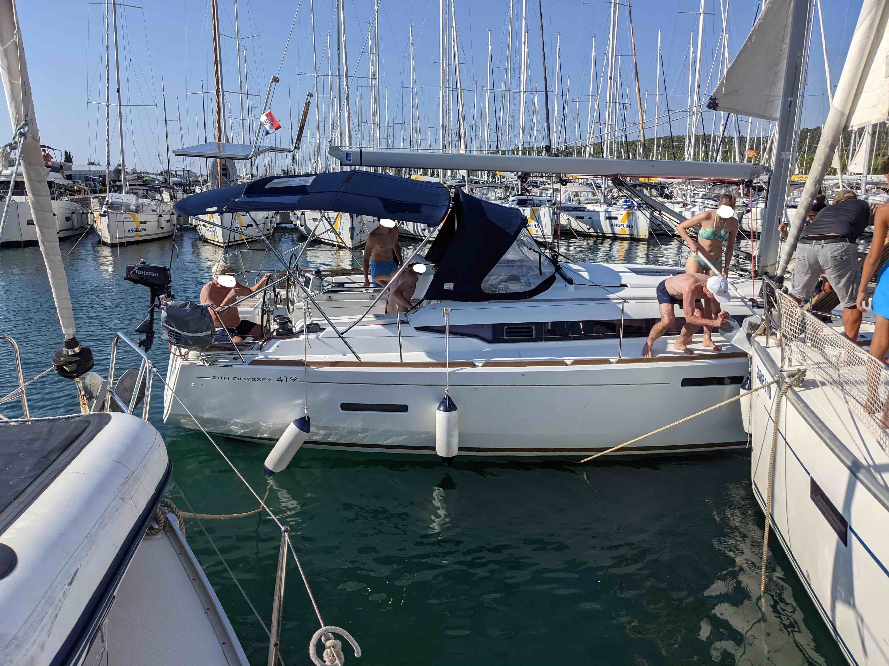

This year, 2024, became the year in which my journey into the world of sailing reached another milestone — I've chartered a boat and skippered it myself! It was an amazing experience, and to my relief, a lot less things went wrong than I had anticipated[^1]. Despite of that, I had a fair share of "lesson learned" moments and thought that it'd be worthwhile to write down a bunch of these learnings. More specifically, I'll try to distill my experience of chartering a mid-thirty foot sailboat for a week in Croatia.

On the internet, there seem to be many [resources](https://www.yachtingmonthly.com/sailing-skills/skippering-a-boat-for-the-first-time-steps-to-success-74120) and [tips](https://www.pbo.co.uk/seamanship/first-time-boat-skipper-tips-for-your-first-voyage-in-charge-87488) regarding skippering a boat for the first time, but not quite as much information about the actual process of _chartering_. Furthermore, skippers generally go through courses that teach them how to sail, dock (but usually not quite well enough for the Med 😅) or passage plan, but often don't cover how to operate the waste tank, how to make sure the boat's batteries are in good shape, or how to avoid the charter company charging you for damages that you haven't done.

With that in mind, I'll try to start with the [charter tips](#charter-tips), and then follow up in a [second part of this blog post](#skipper-tips)<!--TODO link to new post once done--> with a bunch of my first-time skippering tips as well. Note that this isn't going to be a comprehensive list at all, but mostly specific tips stemming from my personal, and obviously quite limited experience.

## Charter Tips

### 1. Check the boat extremely thoroughly
Photograph _everything_. I mean it — really everything. Not just the parts with obvious damage. The one pic you will not take is going the be the one you'll wish you had taken. For example, I had some damage happen at the top of the mast and had no way of checking if it had been already done prior to me getting the boat as I had not taken a pic of the top of the mast during boat check in.

Regarding specific equipment, make sure to count the fenders (they are very easy to lose!) and check all of them for damage. Check that they are not cut and that they hold inflated when squished. Check all the hatches for scratches, especially in easily scratchable areas, like under the dinghy, and also check if the winch handles hold well in the winches. Unfurl and check the sails, and check the dinghy if it holds inflated.

Report _all_ of the damage to the charter company, even if some of it seems unnecessary. Some charter agencies apparently have it a part of their business model to later charge you for damages you fail to report during the boat check. Every little scratch or damaged piece of gear should get reported.

### 2. Check your contract with the charter company

This is even more so the case when booking throught a third-party boat marketplace like [boataround](https://www.boataround.com/). In my case, the boataround booking stated that I should get a free wifi router, but the charter company didn't give it to me. When I said that I should get a wifi router as per my boataround booking, they said that boataround "was lying". I had to argue with them for a little bit until they gave me the router (for free).

### 3. Get the full inventory equipment

Many charter boats are in quite a bad shape and are missing a lot of equipment that is specified in their inventory. Do not give up easily when fighiting with the mariners during the boat check in — they usually try to tell you stuff like, "Oh, x is missing, but do you actually _really_ need x (replace x with harness, sponge,  etc.)?". Well, firstly, you're signing that you got the boat with everything including x, and secondly, it's usually that one thing that you didn't get that you end up missing (like the sponge in my case). So make sure you've got your bucket and sponge 🪣🧽.

### 4. Get extra equipment

Try to not stop at the equipment from the boat's inventory — it's usually the absolute minimum for a lot of charter boats. To give an example, I've been told by another skipper to always demand at least two long lines from the charter company, as this is often the minimum necessary for tying to shore. My charter boat only came with one long line, so I haggled with the mariners for quite a bit until they caved in and gave me a second long line. And of course, during the one night that I spent tied ashore while anchored, I ended up using all the _6 lines_ on board to tie off to the shore, including the extra long line that I had asked for[^2].

When it comes to lines, there are usually never enough, and even though it's usually impractical to bring a full marine line with you, I always bring a small-diameter line, such as paracord, with me to the boat. It's very useful for tying small things in the cockpit, letting crew practice knots, and in so many other situations.

### 5. Don't trust the equipment

In general, the equipment on charter boats is in quite a bad condition, so don't blindly trust it. In my case, one halyard tore at the top of the mast and just fell off, and since this happened with no load on it, I presume it must've been already chafing for quite a long time. Imagine hoisting someone up the mast just using that halyard, that could've ended up tragically.

Double check the accuracy of the depth sensor when in shallow water (e.g. measure it with a line of known length if you can) and don't blindly trust it when the mariner tells you that it is from keel or from the waterline. This was another lesson that I learned, which could've ended up quite badly.

During the check in, the mariner told me that the depth sensor is "from the keel but shows one meter less", which sounded really strange to me, but I trusted it. On the next day, we went to a bay that I remembered to be very shallow, but this time, it seemed completely fine judging by the depth sensor. It was only after we had picked up a mooring buoy that we discovered when diving around the boat that there was only about a meter of water below the keel. This whole time, the depth sensor was showing three meters, so it was in fact showing the depth from the waterline, not from the keel as I had been told.

### 6. Check the engine and fuel system

Besides doing your usual [WOBBLE](https://www.jollyparrot.co.uk/blog/what-engine-checks-should-you-do-before-sailing-272) checks of the engine, make sure to check the engine and fuel system, and in the spirit of the previous section, don't trust that it works, as I found out on the last day of my charter.

The fuel gauge was showing completely full since the first day until the last one, and having only motored for about ten to twenty hours, I thought the we might've not used that much fuel given we had a 150 liter tank. We ended up refuelling 40 liters, which was not at all what the gauge was showing (albeit congruent with our engine hours). I don't know if the fuel gauge was completely stuck or just very reluctant to adjust, but this could've again ended up quite badly[^3], so the tip for future me is the following:

When taking over the boat, take a picture of the engine hours and the fuel tank gauge, then immediately go to refuel[^4] to check that you actually got the boat with a full tank and that the fuel gauge is working properly. 

 when the tank was 73% full")

### 7. Understand the plumbing

Check the operation of the heads and sea cocks carefully with the mariner when taking over the boat — this is not an area to _not_ understand. Every boat is different and boat plumbing can differ. Some charter agencies don't have their boats fitted with holding tanks, some do, so make sure to understand how it works on your particular boat.

I thought I had understood it on our boat, but on the last night, we had a _slight_ 💩 explosion (that got thankfully quickly cleaned by a lovely crew member 💙), despite the waste tank gauge showing 0% full (again, don't trust the equipment). I still don't know if I did something wrong, but I definitely could've been more thorough during the boat check in when questioning the mariner about how the plumbing works.

I'd also consider pumping out the holding tanks whenever the opportunity arises, ideally daily. I know this won't usually be possible, but it's better to err on the side of caution than to have a 💩 explosion.

### 8. Bring your own charts

Don't rely on the charts that come with your boat and get some good charts for your sailing area yourself (e.g. via the [Navionics app](https://www.garmin.com/en-US/garmin-technology/marine-technology/charts-and-maps/navionics-boating-app/)). Charts and chartplotters on charter boats can be out of date, inaccurate, or lacking the proper resolution.

I was once navigating in a bay where the boat's chartplotter was showing the boat already on land, and we were tens of meters away. Also, the chartplotter's depth resolution in bays was useless for figuring out where to drop anchor — it's smallest depth contour was five meters. Thank goodness for the Navionics free trial!

### 9. Bring your own anchor snubber

If you're planning on spending nights on anchor with your charter boat, you probably want to sleep well with the feeling that your anchor will hold. This usually means reversing on it quite hard after it's set to ensure you're not dragging, but this is often difficult to do. On my charter boat, the chain would start skidding out of the windlass if I tried reversing on it, and I shoudln't even be upset about that — the windlass isn't made to hold such forces.

What you really want is an anchor snubber, which usually means a nylon line attached to the bow cleat(s) and to your anchor chain either with a chain hook or directly using a friction hitch. A boat commonly has a nylon line, and I've tried tying it to the chain with a [suitable friction hitch](https://www.practical-sailor.com/safety-seamanship/hitches-to-grip-anchor-chain), but I've found this very time consuming and often tricky to do on the bow. Since I prefer to stay at the helm when anchoring, I wanted something simpler that I could trust my crew members to be able to do quickly and reliably.

That's why I've bought a few chain hooks for common chain sizes, and I'll be bringing them with me for future charter trips. It cost me less than £40, and I think that they'll be simple to quickly put on (and also off later) for any crew member when anchoring, so that I can stay at the helm and reverse on the anchor without issues, and sleep better at night.

### 10. Check your anchor rode

I've seen it happen multiple times on charter boats when picking up anchor that the anchor chain jumped out of the windlass and the anchor just dropped and started taking all the chain with it. Once this happens, there is no way to stop the running chain, so in order to not lose your anchor, double check that the end of your anchor rode (chain/warp) is tied off in the anchor locker. You can't trust your windlass on a charter boat, but you should ensure that there's a good knot holding the end of your anchor rode, as it will be the thing that'll ultimately prevent you from losing your anchor if this happens.

### 11. Avoid the marina rush hour on the last day

Charter boat contracts usually specify that you should return to the base marina the day before your check out day, which is often Friday, and commonly by 5pm. For large marinas, this usually means a total mayhem from around 2pm to 6pm on Fridays, when everyone rushes to come back, refuel, and berth.

The pro move is to ask the charter company for a permission to come in later on the day, or even in the morning of the following check out day. Even if they agree, avoiding the rush hour(s) can be tricky due to unfavourable daylight hours (and you likely don't want to arrive when it's dark) and/or fuel dock opening hours, so make sure to plan accordingly, and always keep some room for delays in your planning.

### 12. Get good insurance (if you can)

This tip could easily warrant a blog post of its own, but in essence, having good insurance for your boat charter can make you a lot less stressed and make the consequences of screw ups a lot more tolerable.

As a private skipper, what you generally want is _Skippers liability insurance_, which broadly covers you in cases when you cause damage to someone else, like to another boat or person (e.g. a crew member). The fun part is that since Brexit, there is almost no choice for this kind of insurance for charter skippers who are UK residents. In the EU, there exist [many](https://www.eis-insurance.com/en/skipper-und-crew/ext-3rd-party-insurance-for-skippers/) [good](https://yacht-pool.com/charter-skipper-insurance/skipper-liability-insurance/) [options](https://www.schomacker.de/en/charter-insurance/skipper-liability.html) that also subsidiarily cover damages to the chartered boat, but in the UK, there is basically only [Pantaenius yacht insurance](https://www.pantaenius.com/uk-en/insurance/skipper-liability/), which does not provide cover for the yacht that you'll be chartering. In either case, expect to pay between £100 and £400 per year, depending on the yacht size.

Without you being covered for damages that you cause to the charter bout, you then have to rely on the insurance provided by the charter company, so make sure to request and examine the insurance documents before your trip. Check what the coverage of the boat is, if it is insured up to its full value, and if there are clauses that make you liable in certain cases, such as if you're deemed "grossly negligent".

Lastly, charter companies often provide _Deposit insurance_, which reduces your refundable boat deposit if you pay a non-refundable fixed part. For example, if the refundable deposit is £2000, you'd pay a non-refundable £200 fee and reduce your refundable deposit to £200. In my mind, this can be a good deal that helps you sleep better at night, even more so considering how many charter companies try to charge you for damages that haven't actually been done by you!

And that's been it for the charter tips! I'm still finishing the post with the skipper tips, but once it's done, I'll link it from here 👇.

## Skipper tips

Still working on this! Watch this space 😅!

[^1]: If you've ever sailed before, you know that things go wrong all the time, so it's usually better to expect the worst and be prepared 🙃.

[^2]: I ended up extending each long line with two extra lines when tying to shore from each stern cleat, and even this was just barely long enough. So yeah, know thy bends as well, e.g the [Zeppelin](https://en.wikipedia.org/wiki/Zeppelin_bend) and/or ([double](https://en.wikipedia.org/wiki/Sheet_bend#Double_sheet_bend)) [sheet](https://en.wikipedia.org/wiki/Sheet_bend) bends.

[^3]: I can imagine a previous skipper not bothering to refuel the boat at the end of their charter given the fuel gauge was showing full. I can then also imagine the next skipper getting the boat, and running out of fuel despite the fuel gauge showing full, and having the engine die, potentially leading to a very dangerous situation.

[^4]: Instead of actually going to the fuel dock, a good idea to save time, especially if the fuel dock is near, might be to send a crew member with a jerry can to get 10 liters of diesel, and then pour it manually. See how much the tank takes, and keep the rest in the jerry can for using throughout/at the end of your trip.
