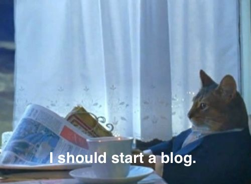

It has finally happened.

After years of living only in my todo app, my blog has finally made it to the internet!

The cliché of _the blog_ being something that so many people want to start, but just never end up getting to, has turned out quite true. For me, it's been almost three years since I [got my domain name](https://taimur.me/posts/domain-names/) (and already changed it _twice_ since<!-- 🤷‍♂️-->), and [more than two years](https://jsomers.net/blog/speed-matters) since writing the infamous "Start a Blog" in my todos.

But nonetheless, here we are! It isn't the best set up, and I'm already looking forward to doing a complete revamp of my site, but I'll try to keep in mind that trying to find the perfect website/blog set-up is an [uphill battle](https://kevquirk.com/my-blogging-utopia/). If I I happen to [write about it](https://rakhim.org/honestly-undefined/19/) in the future, I'll hopefully set up some tags/categories of posts, so that only those interested can check it out.

Of course, it should be the content that matters, which opens up the question about the goals and motivation behind this blog.

Despite the rebirth of blogging and online newsletters in the recent years, it's still odd for someone from my generation to blog and not just post on social media, even more so without a profit motive. To illustrate this with an example — someone recently asked me for my Instagram and replying that I don't have Instagram but have a website resulted in the reaction: "wow, that's super shady".

## So why a blog then?

My motivation seems to stem from a variety of places.

To a large part, it is due to how much value I got from reading blogs of others on the internet. Especially since I reduced my social media usage, I have spent more time reading posts on the open internet, and have been quite a bit happier with them. It might be the actual longer-form reading instead of endless scrolling of short posts, or the absence of misincentivised algorithms and angry commments, or even the natural selection of people willing to set up a blog. I don't know, it's just a better experience to me.

And I would like to be a part of that.

On the other hand, I'm also quite sad with the general state of the internet. [Closed silos](https://www.facebook.com/) run by corporations that show their complete disrespect for their users time and time again, but continue operating their de-facto monopolies due to their power and network effects. Everyone fighting for attention, hooked on the dopamine rush from every new like, gaming the algorithms, promoting more and more extreme stuff, and the subsequent decline of democracies all over the world.

And I do _not_ want to be a part of that.

I'd like to be a part of an internet where people have [their own space](https://victoria.dev/blog/make-your-own-independent-website/) to be genuine and their connections and relationships with others aren't [assets of someone else](https://avc.com/2021/01/controlling-your-destiny/). I'd like to write about stuff that I find interesting myself, without worrying too much about it being popular or not. [Just me](https://sive.rs/real), sharing my thoughts, stories, and experiences, and allowing everyone who might be interested to [get in touch](mailto:hi@adam.sr).

## So what's next?

Ugh, it got a little cheesy, and I know me having a blog won't solve any of the big issues we're experiencing right now, but I honestly just wanna try out this indie website and blogging thing. I also secretly hope to develop at least a little writing habit, to not get completely slack now that I'm out of uni.

When it comes to the actual things I wanna write about in the near future, I'm thinking of writing some of my travel stories, and perhaps some thoughts on a variety of topics that I find interesting and have had blog ideas sitting dormant in my todo app for years. Plus maybe the occasional tech post.

If you've realised how cleverly I've avoided all accountability by being super vague with the topics and not setting any specific writing goals, AND you'd still be interested to hear more, I'd really encourage you to **subscribe to updates via email [here](https://buttondown.email/as) or via RSS [here](/index.xml)**. I'm genuinly going to be very happy if you do so 😊.

