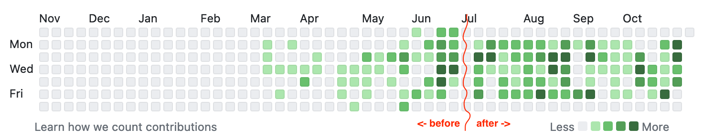

This blog is the third part of the [5 Lessons after 5 Months of a Full-time Job](/job) series.

One of the biggest changes that a job brings compared to school/uni is the clear boundary between work and _not_ work. Despite it being fuzzy and blurred in reality, you've most likely signed a contract that clearly specified the work hours for which you get paid (9 to 6, with a one hour lunch break, right?). Apart from the other 40 pages of cryptic lawyer-speak in which you give up all of your rights and agree to work ∞ overtime, there hopefully should be some truth to these boundaries.

This is a major difference from school & uni, which are to some extent, as sad as it sounds, systems of placing people in a distribution so that employers can pick "the best", by making everyone participate in a limited-time, zero-sum competition with no boundaries. In other words, you have limited time to study for an exam, the result of which will place you in a numbered list compared to all your peers. Only the first x % of people get the best grade, so not everyone can get it, even if they studied their asses off.  Both my [high school](https://www.ibo.org/contentassets/bc850970f4e54b87828f83c7976a4db6/dp-statistical-bulletin-may-2020-en.pdf) and [uni](http://teaching.eng.cam.ac.uk/content/marking-classing-criteria) worked like this, with the latter one historically even [placing this list in public](https://www.theguardian.com/education/2015/may/20/cambridge-students-petition-against-public-exam-results).

Don't get me wrong — I'm a fan of competition, but there needs to be a balance, and one of the things that that system achieved was a culture of everyone working non-stop. People would be pulling crazy hours to study, and often play it down because working hard basically meant you're trying to put others down in the list. If you've been as lucky as me, this will be gone now — you obviously don't want to rest on your laurels, but if you're in a functional team, you won't be trying to win over your colleagues, but win in the market as a team and as a company.

The market is tough and competitive, but I generally feel the incentives for employees are much "nicer", than they were for 300 students sitting in one room who knew that only a fraction of them would get the best grade. Employees in different companies will also be on broadly similar 40hr/week contracts, and there are laws & regulations that make it a bit more difficult for your employer to make you work overtime and on the weekends, which results in a more even playing field for everyone.

Despite of this, I feel that a lot of people from a similar background like me only learn this the hard way, or never at all, and continue with their old habits until something bad happens or they burn out. It was the same for me, and I think being a newbie in your field and feeling like an imposter contribute to this even more. When the first big project that I was tasked with at work started going a little off the plan, I started working more, spending long hours in the office, thinking I need to "catch up".

Obviously, this wasn't working well, and I was actually doing little more progress. Again going back to the principle of constrained productivity mentioned in the [previous part](/scarce), I found out there is a huge drop in efficiency when you mentally agree to "stay in the office as long as I need to do X", compared to having well defined time boundaries. Not only are there diminishing returns to working more, but I have found out you actually accomplish more when working less!

I can trace this to a particular week during the aforementioned project when I flipped a switch and realised that it just isn't going to get any better by me spending all the time in the office, and finally set clear boundaries. I told myself I will leave work before 7pm every day, and don't work on the weekends. To aid this, I also made it a rule to leave my work laptop in the office, which I've been quite good at, and it has manifested in how my contribution (commit) history looks:

This is when things actually started improving. I started getting more done in normal hours, and I had more time to relax outside of work (weekends, in particular, improved tremendously). It obviously isn't a silver bullet, and there are still days where I'm less productive than I'd like, but it has helped me a lot. I also realise that being able to set boundaries as clear as this and leave laptop at work is a privilege — things like having kids and/or working from home make this much more difficult, but I'd still encourage people to try to set boundaries and rules to aid sticking to them.

There is also a second thing I did that week which improved things a lot — I started caring less. As bad as this sounds, I feel that this is crucial to adopt for many people like me, as they are naturally skewed the other way. By default, I really, _really_ care. I care an awful lot, to the point where it would negatively influence my work, as it would make me worry.

I spent the first few months of my job constantly worrying. Every few minutes I'd think about how unskilled I am and whether they're gonna fire me tomorrow. Every message from my boss I'd interpret as being passive-aggressive, as a hint that I was doing a bad job. I now know that [this happens to a lot of people](https://www.youtube.com/watch?v=QHXET1G9Y5U), and I also know that it sucks — you can't focus, and you're not performing to your full potential. What finally changed this and made me worry less was a simple observation:

 You are not your job.

You are not your job. Despite people saying things like "I'm a software engineer", I'm actually generally against this sort of labelling. You are a million different things - a friend, a son/daughter, a citizen, etc. I also happen to _do_ software engineering, and I really, _really_ like it. But I am not my job, and this realisation made me worry less about being fired, and made me enjoy my job a lot more.

It made me care a bit less, but this has actually been beneficial. There are always a million different things going wrong in just about any company, and I've found that being able to distance myself from them actually makes me better fixing them. When something f\*cks up, I no longer worry about getting fired, but I actually start looking into how I can fix it. That is why I'm doing this in the first place — fixing problems with computers is fun 🤓🧑‍💻!

I also think that a second contributing factor is that as you get (a bit) better, the prospect of getting fired gets less scary. As you start improving, and even more importantly, seeing a _path towards improvement_, you say to yourself: "Well, if they fire me, I'll learn X, Y, Z, leetcode a bit, and probably find another job!". **TODO add a footnote saying that key to this is good money habits as written in first section - much easier to have this mentality when you have no debt and 6 months of expenses in cash at hand at all times. (and also link post of cumulative probability of finding a job with low single event success).** This sounds bad, but for me, being a bit stoical[^5] about things makes me actually enjoy them a lot more, as I can focus way more deeply if I don't worry about the worst-case-scenario.

This is another crucial difference between school/uni and work that I see — the consequence of failure is much lower. Back in school, and particularly at my uni, you could _not_ fail. There were no exam resits — failing meant getting kicked out and not being able to apply back. I've always found this terryfing, especially how the whole society and your family just expects you to pass (i.e. not to fail). Everyone graduates, right? So you should too! Frankly, I find this tolerance to failure so much better now, where worst case is just getting fired. It's a free market, and you can fail and try again as many times you like. It's liberating.

To sum up, my time at my job so far has taught me how important it is to set and maintain clear boundaries, and to consciously try to worry less about your job. This has resulted in me really looking forward to going to the office, to solving interesting problems, to learning and asking more questions (since I don't worry about sounding dumb!), and also improved my free time ☀️🌈.

Read the next part of the [series](/job) series:
**TODO**


[^5]: Here I mean stoical as defined in [this](https://sirupsen.com/books/a-guide-to-the-good-life) [book](https://sive.rs/book/StoicJoy). I really recommend it to de-mistify what stoicism _actually_ means.