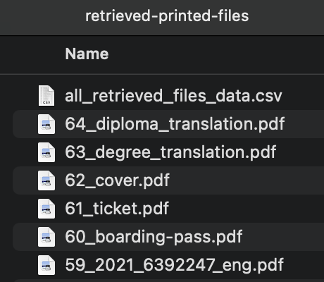
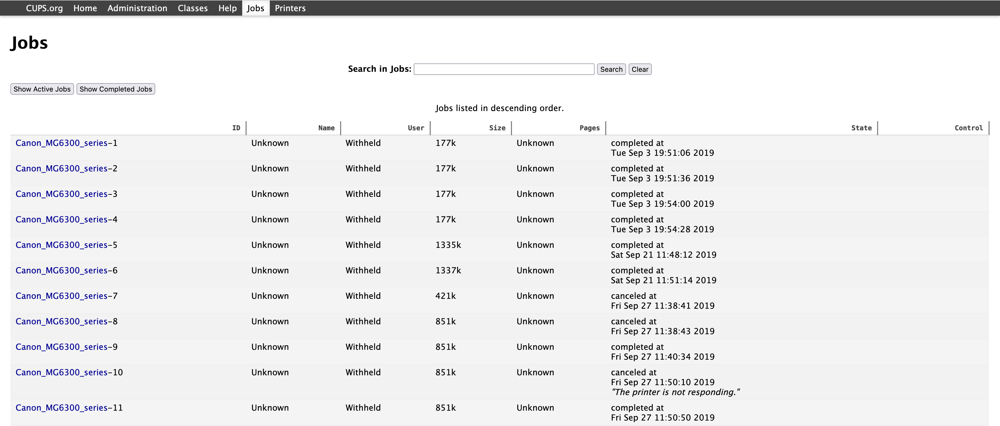
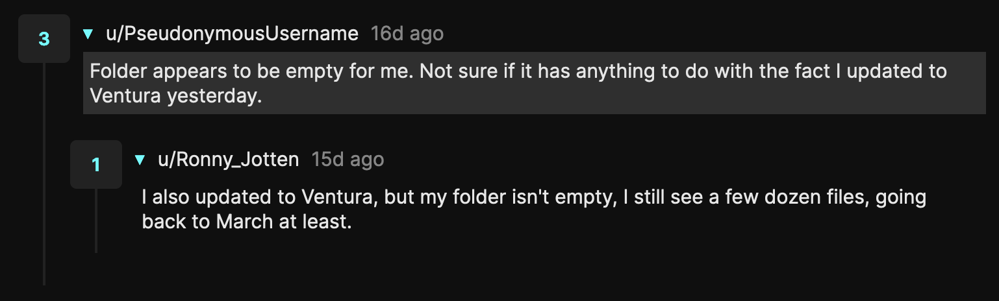

A few weeks ago I stumbled upon a video titled ["_macOS stores a copy of everything one prints forever_"](https://youtu.be/eAgfeVNKdoo), which talks about the same thing as a [similarly called Reddit thread](https://www.reddit.com/r/YouShouldKnow/comments/yhftqo/ysk_macos_saves_a_copy_of_everything_you_print/) that was posted the same day and received more than 8000 upvotes. Apparently, macOS keeps a copy of every file that you ever print, even if you delete the original file, so it would seem.

Being naturally curious about this, I opened up terminal, ran a few commands and .… voilà! I found information about every file I ever printed on my mac and **the actual pdf files** of more than half of them, including potentially sensitive ones like various vaccination or immigration certificates. Wow! So no, this post does not really have a [Betteridge headline](https://en.wikipedia.org/wiki/Betteridge%27s_law_of_headlines)!

## How to do it?

Before diving down into how it works, here's the tl;dr if you just wanna get the files. Note that depending on your system, you might recover all, some, or none of your files, but since it's quick to check, you might as well try it.

The first step is to [open terminal](https://www.howtogeek.com/682770/how-to-open-the-terminal-on-a-mac/) and type in:

```bash
sudo ls /var/spool/cups
```

Then press enter, type your password[^1], and press enter again. If the output shows a bunch of files starting with `c` or `d` followed by numbers, e.g. `c00001` or `d00021-001`, as shown below, you're golden and ready to recover some of your previously printed files. If you don't see such files and want to find out why, read the next section.


To recover the files, I wrote a quick Python script that tries to retrieve the printed files and their info (e.g. name, time of printing). You can download it [here](https://codeberg.org/adam/mac-retrieve-printed-files/archive/main.zip) and check out [its repository on Codeberg](https://codeberg.org/adam/mac-retrieve-printed-files) (or [GitHub](https://github.com/adam-sroka/mac-retrieve-printed-files)).

After you download and unzip it, make sure you've got [Python installed](https://realpython.com/python-first-steps/#how-to-download-and-install-python), and then [change the terminal directory](https://stackoverflow.com/questions/9547730/how-to-navigate-to-to-different-directories-in-the-terminal-mac) to the folder with the script (assuming you've extracted it to a `mac-retrieve-printed-files` folder within your `Downloads`, run `cd ~/Downloads/mac-retrieve-printed-files`) and then run:

```bash
sudo python retrieve_printed_files.py
```

Then again, type in your password and press enter. This will attempt to create a new folder (shown below) with all retrieved files and a csv file with information about every file ever printed, even if the file itself could not be recovered.



You can look in the created `retrieved-printed-files` folder to check out the retrieved PDF files, and open the `all_retrieved_files_data.csv` to see information about all previously printed files, even if the actual files could not be recovered.

If you don't like running a random Python script as root, check out [the repository](https://codeberg.org/adam/mac-retrieve-printed-files) to examine it, or to alternatively run a four-line shell script (also in that repo) that will just try to recover the files without their metadata.

There you go!

The following sections will delve into the inner workings of how/why this works, but if you'd just like to delete the print history and/or prevent your Mac from keeping copies of printed files in the future, check out the section [_How to purge everything and stop further print files being saved?_](#how-do-i-purge-everything-and-stop-further-printed-files-being-saved)<!--TODO: fix link--> below, or see [the guide](https://sunknudsen.com/privacy-guides/how-to-disable-cups-pinter-job-history-on-macos) from [the original video linked above](https://youtu.be/eAgfeVNKdoo), or even the [Reddit thread](https://www.reddit.com/r/YouShouldKnow/comments/yhftqo/ysk_macos_saves_a_copy_of_everything_you_print/).

## How does this work?

Ok, now for the deep dive!

MacOS uses an open-source printing system called [CUPS](), which is developed by Apple, but also used by some Linux distributions for file printing. When you print a file, CUPS make a copy of the file and stores it in a CUPS _data file_, such as `d00123-001`. Along the data file, CUPS also creates a _control file_, such as `d00123`, which stores other information about the print job, such as the name of the printer, file name, time of printing, and so on. Upon printing, these files are created in the `/var/spool/cups` directory.

To recover the files, you can just copy the CUPS directory and add the correct extension to the data files to retrieve the original file, e.g. `d00123-001.pdf`. For me, I've only ever printed pdfs, so adding `.pdf` to each data file did the trick. However, if you want to find out the _metadata_, i.e. the original file name, or the time of printing, you have to dissect the control files, which is a little messy.

Before starting to parse the control files, a quick n' easy alternative is to use the CUPS web interface, as outlined in [this article](https://osxdaily.com/2011/01/20/show-print-history-mac/) from more than a decade ago. Basically just run `cupsctl WebInterface=yes` in the terminal and then open [http://localhost:631/jobs?which_jobs=all](http://localhost:631/jobs?which_jobs=all) in your browser to see your printing history:



To get more information about the printed files, the control files have to be parsed. They unfortunately don't use a common format or encoding, so I initially struggled with parsing these binary files. Luckily, as with almost anything, some people have already had the same issue and [asked about it on Stack Overflow](https://stackoverflow.com/q/53688075), which led me to discover [go-cups-control-files](https://github.com/ui-kreinhard/go-cups-control-files), an open-source Go library for parsing CUPS control files.

However, since Go doesn't come as standard on Macs[^2], and this use case of extracting all previously printed files was a bit different, I wrote the [Python script mentioned above](https://codeberg.org/adam/mac-retrieve-printed-files) — now Go compiling isn't needed. The original question on Stack Overflow also mentions the possibility of compiling CUPS from source and using the `testipp` CLI to parse the control files, so feel free to use what you like.

## But wait, so does Mac really store every printed file forever?

Yes and no. As explained above, when you print a file, CUPS stores its copy in a data file such that it can convert it to the desired format for your printer. The real question is, for how long are these files kept, and if/when are they purged? The answer does not seem to be universal.

In my case, CUPS stored all control files of every file I've ever printed (dating years back) and about two thirds of those also had data files[^3]. But YMMV — when reading the comments on YouTube and Reddit, people encountered a range of scenarios:




Why such diverse scenarios? What controls how long are CUPS files stored? The CUPS configuration files.

CUPS stores in config files in the `/etc/cups` directory, the main config file being `cupsd.conf`. Reading [the official `cupsd.conf` documentation on apple.com](https://opensource.apple.com/source/cups/cups-327.6/cups/doc/help/ref-cupsd-conf.html.in) reveals a number of parameters that can be tweaked:

- `PreserveJobHistory`: controls whether the history of completed, canceled, or aborted print jobs is retained, default value is On.

- `PreserveJobFiles`: controls whether the document files of completed, canceled, or aborted print jobs are retained, default value is 1d (one day).

- `AutoPurgeJobs`: specifies whether or not to purge completed jobs once they are no longer required for quotas, default setting is No.

- `MaxJobs`: controls the maximum number of jobs that are kept in memory, default setting is 500.

These defaults would suggest that job data is retained forever, but job files are kept just for a day. However, I couldn't find any changed values in my `cupsd.conf` file and still had a job file history of around 40 files, going back many months, which isn't in accordance with the defaults, so dunno 🤷‍♂️.

## How do I purge everything and stop further printed files being saved?

Based on the parameters mentioned above, opening `cupsd.conf` (e.g. by `sudo nano /etc/cups/cupsd.conf`), pasting in the following lines and [saving the file](https://linuxconfig.org/how-to-save-and-exit-file-using-nano-editor) should prevent further files from being saved:

```bash
MaxJobs 0
PreserveJobHistory Off
PreserveJobFiles Off
AutoPurgeJobs Yes
```

And to purge the currently saved files, just run this in terminal:

```bash
cancel -a -x
```

This is also covered in [the tutorial linked to the YouTube video by Sun Knudsen](https://sunknudsen.com/privacy-guides/how-to-disable-cups-pinter-job-history-on-macos) mentioned above.

That being said, the thing is, should you even bother changing CUPS configs to prevent your files from being kept? Is letting CUPS store your printed files that big of a big deal? I'm gonna explore that in the following section.


## So should I be worried?

Very likely **no**.

The original video and the Reddit thread, along with the discussion that followed, were quite focused on the security and privacy implications of files being kept by CUPS. However, from a security standpoint, this really isn't much of an issue. The CUPS folder is protected, so as a "regular" user, you can't even access it in Finder, since you can only read and copy it with root privileges.

This basically means that the files have the highest level of protection on your Mac, and someone has to have access to your computer and know your password to get to them. That person should only be you anyway, so if that ain't the case, you prolly have some bigger problems!

I think that the issue, which understandably upset many people, is in fact the difference between the _expected behaviour_ from the user's point of view and the _actual behaviour_ under the hood. If you print a file and then delete it, you don't expect that that file is gonna stick around somewhere in your computer afterwards.

However, in this day and age, where there's full disk encryption (FileVault on Mac), there's really not much to worry about. There's probably a ton of more sensitive stuff lying somewhere in your computer, but only you with your password should be able to access it.

In fact, it _should be the case_ that your print history shouldn't be the most incriminating stuff on your computer, since the computer isn't the problem in this case. The real problem is the inherent insecurity of _actually printing_ sensitive documents.

## Printing itself is the culprit!

This is the case since printing documents requires you to either print stuff using someone elses printer, or your printer, neither of which are secure operations.

When printing somewhere else, e.g. in your work or school/university printers, you're usually sending the files to [someone else's computer](https://blog.briangreenberg.net/2016/05/29/there-is-no-cloud-its-just-someone-elses-computer/), where they can be logged and easily attributed to you. And when printing on your own printer, the good ol' question to ask is — is your printer actually yours?

Unlike 3D printers, there [doesn't seem to by any commonly available open-source printers](https://www.quora.com/Is-there-any-open-source-hardware-for-inkjet-laserjet-printers-and-multi-function-devices/answer/Steve-Owens-6), which means that you have no idea what is your printer actually doing, and it probably isn't anything with your best interest in mind (who would've thought!).

As pointed out by NGOs like [the EFF years ago](https://www.eff.org/press/archives/2005/10/16), the [_majority_](https://www.eff.org/pages/list-printers-which-do-or-do-not-display-tracking-dots) of common printers [secretly embed information like their serial number and the time of printing into each printed page[^4]](https://www.eff.org/deeplinks/2017/06/printer-tracking-dots-back-news). And since so many of them are now ["smart"](https://www.theguardian.com/lifeandstyle/2021/sep/23/the-smart-toilet-era-is-here-are-you-ready-to-share-your-analprint-with-big-tech), they also connect to the internet, [which is _obviously_ great](https://www.ifitssmartitsvulnerable.com/)!

Yup, so if you were just about to print that `death_threat_letter.pdf`, you might wanna reconsider that 🙊!

All jokes aside, the conclusion is that you shouldn't worry about printing your normal documents, but might want to think twice with more sensitive stuff like cryptocurrency paper wallets, which was the starting point of [the original video](https://youtu.be/eAgfeVNKdoo) that inspired this blog.

Thanks a lot for reading, and if you've stuck til the end, I'd be really happy if you [**subscribe to my blog**](https://buttondown.email/as), or [get in touch with me](mailto:hi@adam.sr)! Have a good one!


[^1]: You _won't_ see the characters as you type.

[^2]: Although my script currently requires Python 3, I might rewrite it to be compatible with Python 2 that comes as standard on Macs. EDIT: Apparently, [macOS stopped coming with Python 2 from this year](https://docs.python.org/3/using/mac.html), so I guess less work for me. 

[^3]: Interestinglty, the data files weren't kept for a continuous range of latest printed files, as I would've assumed, but there were some gaps in between — I might explore that in the future.

[^4]: Thanks to this, "bad guys" like whistleblowers can ["thankfully" end up in jail](https://www.bbc.com/future/article/20170607-why-printers-add-secret-tracking-dots)!