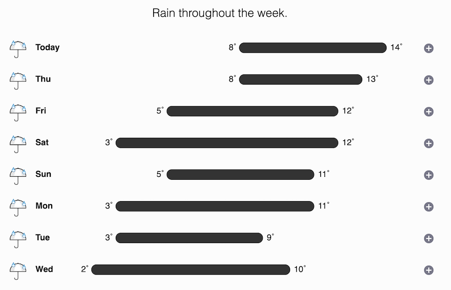

Hi there!

I hope you're doing well, and staying strong despite winter slowly approaching ☃️. I'm just about managing in this London weather:

Regarding my blog, I finally managed to do a revamp of [my website](https://adam.sr) (so that posts are readable on phones too!), and published a post delving into the recent online claims that Macs keep a copy of every file you print forever, even if you delete it. Check it out if you're interested:

[MacOS Stores a Copy of Everything You Print Forever - Really?](https://adam.sr/blog/printing/)

I also managed to brink back my Mastodon account that's been sitting dormant for more than a year, so if you're on the Fediverse, feel free to ping me at [@adamsroka@mstdn.io](https://mstdn.io/@adamsroka) 😊.

That's all folks, have a good one!

Regards,
Adam